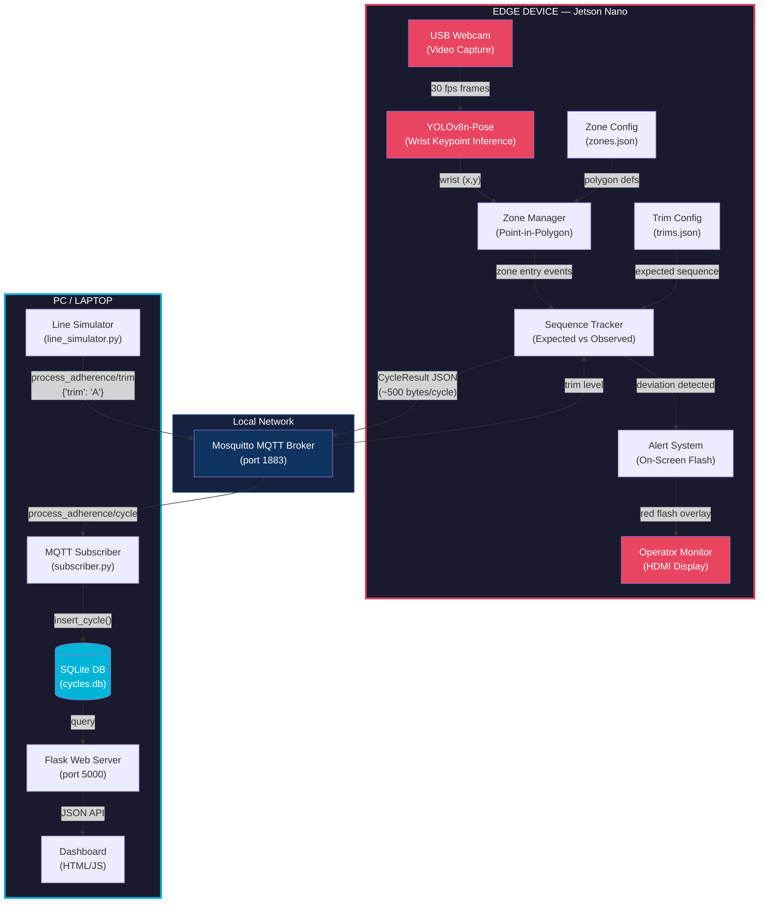
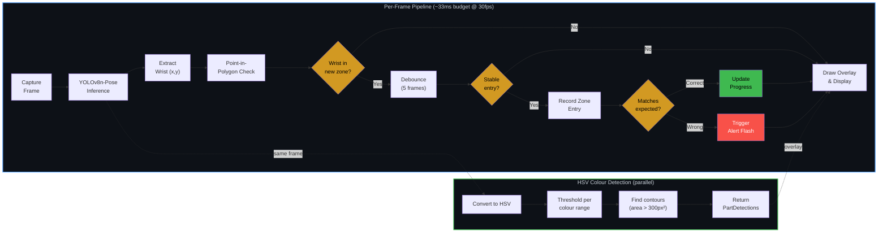
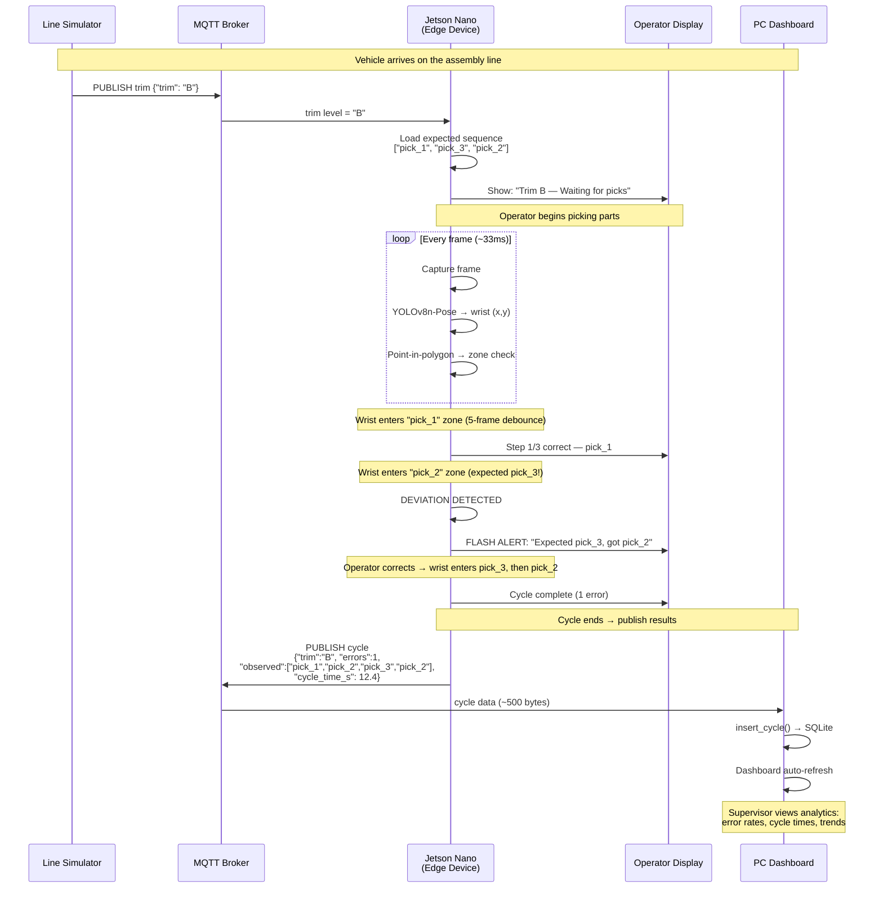

# Architecture Diagrams

## 1. System Architecture — Edge vs. Cloud

```mermaid
graph TB
    subgraph EDGE["EDGE DEVICE — Jetson Nano"]
        direction TB
        CAM["USB Webcam<br/>(Video Capture)"]
        YOLO["YOLOv8n-Pose<br/>(Wrist Keypoint Inference)"]
        ZM["Zone Manager<br/>(Point-in-Polygon)"]
        SEQ["Sequence Tracker<br/>(Expected vs Observed)"]
        ALERT["Alert System<br/>(On-Screen Flash)"]
        MONITOR["Operator Monitor<br/>(HDMI Display)"]
        TRIM_CFG["Trim Config<br/>(trims.json)"]
        ZONE_CFG["Zone Config<br/>(zones.json)"]

        CAM -->|"30 fps frames"| YOLO
        YOLO -->|"wrist (x,y)"| ZM
        ZM -->|"zone entry events"| SEQ
        TRIM_CFG -->|"expected sequence"| SEQ
        SEQ -->|"deviation detected"| ALERT
        ALERT -->|"red flash overlay"| MONITOR
        ZONE_CFG -->|"polygon defs"| ZM
    end

    subgraph NETWORK["Local Network"]
        MQTT["Mosquitto MQTT Broker<br/>(port 1883)"]
    end

    subgraph PC["PC / LAPTOP"]
        direction TB
        SUB["MQTT Subscriber<br/>(subscriber.py)"]
        DB[("SQLite DB<br/>(cycles.db)")]
        FLASK["Flask Web Server<br/>(port 5000)"]
        DASH["Dashboard<br/>(HTML/JS)"]
        SIM["Line Simulator<br/>(line_simulator.py)"]

        SUB -->|"insert_cycle()"| DB
        DB -->|"query"| FLASK
        FLASK -->|"JSON API"| DASH
    end

    SEQ -->|"CycleResult JSON<br/>(~500 bytes/cycle)"| MQTT
    MQTT -->|"process_adherence/cycle"| SUB
    SIM -->|"process_adherence/trim<br/>{'trim': 'A'}"| MQTT
    MQTT -->|"trim level"| SEQ

    style EDGE fill:#1a1a2e,stroke:#e94560,stroke-width:3px,color:#fff
    style NETWORK fill:#16213e,stroke:#0f3460,stroke-width:2px,color:#fff
    style PC fill:#1a1a2e,stroke:#00b4d8,stroke-width:3px,color:#fff
    style CAM fill:#e94560,color:#fff
    style YOLO fill:#e94560,color:#fff
    style MONITOR fill:#e94560,color:#fff
    style MQTT fill:#0f3460,color:#fff
    style DB fill:#00b4d8,color:#fff
```

## 2. Edge Device — Per-Frame Processing Pipeline

```mermaid
flowchart LR
    subgraph FRAME["Per-Frame Pipeline (~33ms budget @ 30fps)"]
        direction LR
        F1["Capture<br/>Frame"] --> F2["YOLOv8n-Pose<br/>Inference"]
        F2 --> F3["Extract<br/>Wrist (x,y)"]
        F3 --> F4["Point-in-<br/>Polygon Check"]
        F4 --> F5{"Wrist in<br/>new zone?"}
        F5 -->|"No"| F7["Draw Overlay<br/>& Display"]
        F5 -->|"Yes"| F6["Debounce<br/>(5 frames)"]
        F6 --> F6B{"Stable<br/>entry?"}
        F6B -->|"No"| F7
        F6B -->|"Yes"| F8["Record Zone<br/>Entry"]
        F8 --> F9{"Matches<br/>expected?"}
        F9 -->|"Correct"| F10["Update<br/>Progress"]
        F9 -->|"Wrong"| F11["Trigger<br/>Alert Flash"]
        F10 --> F7
        F11 --> F7
    end

    subgraph COLOR["HSV Colour Detection (parallel)"]
        C1["Convert to HSV"] --> C2["Threshold per<br/>colour range"]
        C2 --> C3["Find contours<br/>(area > 300px²)"]
        C3 --> C4["Return<br/>PartDetections"]
    end

    F2 -.->|"same frame"| C1
    C4 -.->|"overlay"| F7

    style FRAME fill:#0d1117,stroke:#58a6ff,stroke-width:2px,color:#c9d1d9
    style COLOR fill:#0d1117,stroke:#3fb950,stroke-width:2px,color:#c9d1d9
    style F5 fill:#d29922,color:#000
    style F6B fill:#d29922,color:#000
    style F9 fill:#d29922,color:#000
    style F11 fill:#f85149,color:#fff
    style F10 fill:#3fb950,color:#000
```

## 3. Full Cycle Sequence — Trim Arrival to Dashboard

```mermaid
sequenceDiagram
    participant SIM as Line Simulator
    participant MQTT as MQTT Broker
    participant EDGE as Jetson Nano<br/>(Edge Device)
    participant OP as Operator Display
    participant PC as PC Dashboard

    Note over SIM,PC: Vehicle arrives on the assembly line

    SIM->>MQTT: PUBLISH trim {"trim": "B"}
    MQTT->>EDGE: trim level = "B"
    EDGE->>EDGE: Load expected sequence<br/>["pick_1", "pick_3", "pick_2"]
    EDGE->>OP: Show: "Trim B — Waiting for picks"

    Note over EDGE,OP: Operator begins picking parts

    loop Every frame (~33ms)
        EDGE->>EDGE: Capture frame
        EDGE->>EDGE: YOLOv8n-Pose → wrist (x,y)
        EDGE->>EDGE: Point-in-polygon → zone check
    end

    Note over EDGE: Wrist enters "pick_1" zone (5-frame debounce)
    EDGE->>OP: Step 1/3 correct — pick_1

    Note over EDGE: Wrist enters "pick_2" zone (expected pick_3!)
    EDGE->>EDGE: DEVIATION DETECTED
    EDGE->>OP: FLASH ALERT: "Expected pick_3, got pick_2"

    Note over EDGE: Operator corrects → wrist enters pick_3, then pick_2

    EDGE->>OP: Cycle complete (1 error)

    Note over EDGE,PC: Cycle ends → publish results

    EDGE->>MQTT: PUBLISH cycle<br/>{"trim":"B", "errors":1,<br/>"observed":["pick_1","pick_2","pick_3","pick_2"],<br/>"cycle_time_s": 12.4}
    MQTT->>PC: cycle data (~500 bytes)
    PC->>PC: insert_cycle() → SQLite
    PC->>PC: Dashboard auto-refresh

    Note over PC: Supervisor views analytics:<br/>error rates, cycle times, trends
```
